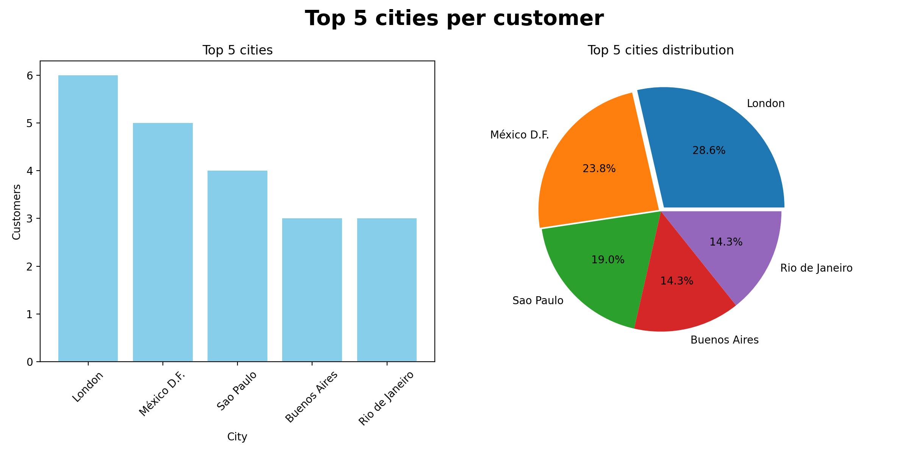

# da-sql-py-firstProject

Test project including.
- launching a docker container containing a postgres database
- population of the database with well-known data from the northwind DB
- running the container on port localhost:5432
- code for retrieving data from the DB based on a simple sql query
- table analysis using the pandas library
- creation of a graph using the matplotlib library
- image export to jpg



## How to?

- install docker
- install python v3.6+
- create docker image with postgres database (you may need sudo privileges). You do in once.

```bash
# get (pull) postgres image
docker pull postgres

cd docker_files
```

### Docker file

```dockerfile
FROM postgres
ENV POSTGRES_DB=northwind
ENV POSTGRES_USER=northwind
ENV POSTGRES_PASSWORD=northwind
COPY ./northwind.sql /docker-entrypoint-initdb.d/
EXPOSE 5432
```

### build image

```bash
# Build new image with db
# -t - container tag, name
# . (dot) - don't forget the dot at the end!
docker buildx build -t nwdb .
```

### Run container

From now on, you can run the container from the built image, which includes the Northwind database

```bash
# run container
# -d - detached (run in background)
# -rm - remove container after quit
# -p - expose port
# -e - setting password for db
docker run -d --rm -p 5432:5432 --name nwdbc -e POSTGRES_PASSWORD=northwind -d nwdb
```
### Run python script
```bash
cd ~/{project_directory}

python3 main.py

# run script with csv export
python3 main.py -csv
```
- check the generated graphs in the plots catalogue (jpg)

```bash
# stop container
docker stop nwdbc
```